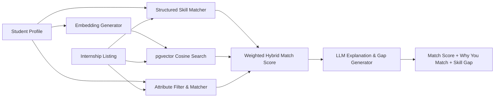
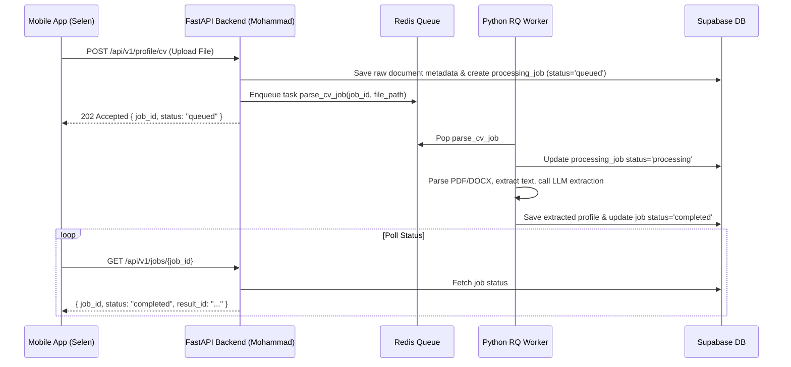

# InternMatch AI — System Architecture Document

**Version:** 1.0.0  
**Status:** Approved & Authoritative  
**Target Runtimes:** Python 3.13 (Backend/Worker), Node.js 22 LTS / 24 LTS (`>=20.0.0`) (Mobile/Landing)  

**Authors:** Mohammad & Selen (Two-Person Student Team, Affiliation: AISS Club — Üsküdar University)

---

## 1. Executive Summary & Product Vision

**InternMatch AI** is a production-minded, AI-powered personalized internship matching and application assistant designed for students and early-career candidates.

### Core User Journey
```
[CV Upload] 
   └──> [AI Profile Extraction] 
           └──> [Internship Matching] 
                   ├──> [Match Score (Deterministic + Vector Similarity)]
                   ├──> [Why You Match (LLM Grounded Explanation)]
                   ├──> [Skill Gap Analysis]
                   └──> [Personalized Application Generation] 
                           └──> [Application Tracker]
```

---

## 2. Team Ownership, Identity & Operational Boundaries

**Team Identity & Affiliation Statement:**  
InternMatch AI is created and developed by a two-person student team, **Mohammad** and **Selen**. Both team members are students at **Üsküdar University** and are affiliated with **AISS Club**. AISS Club represents their student-club affiliation and does not imply university ownership, sponsorship, funding, or intellectual-property ownership of the project. Mohammad serves as the official President of AISS Club, and Selen serves as the official Vice President of AISS Club.

```
InternMatch AI
    ↓
Two-Person Student Team
    ├── Mohammad (AISS Club President)
    └── Selen (AISS Club Vice President)
          ↓
Affiliation:
AISS Club — Üsküdar University
```

### 2.1 Responsibility Breakdown

| Domain / Task | Responsible Member(s) | Primary Scope & Technologies |
| :--- | :--- | :--- |
| **Backend & Infrastructure** | **Mohammad** | FastAPI (Python 3.13), Supabase PostgreSQL + pgvector, Redis, RQ Worker, Docker, Security, API Contracts, AI Pipeline, RAG/Retrieval, Deployment |
| **Frontend & Mobile** | **Selen** | React Native (Expo, TypeScript), Next.js (Landing, TypeScript), UI/UX, Mobile Screens, Interaction Design, Product Experience, Frontend API Integration |
| **Joint Responsibility** | **Both (Mohammad & Selen)** | Product decisions, Architecture review, Hackathon strategy, Testing, Demo video creation, Submission, Product presentation |

**Boundary Principle:** The frontend and backend are strictly decoupled and independently developable. The authoritative API contract (`docs/API_CONTRACT.md`) defines the strict interface boundary between them.

---

## 3. High-Level Architecture Topology

```mermaid
graph TD
    subgraph Client Tier (Selen)
        MobileApp["Mobile App (React Native / Expo / TS)"]
        LandingPage["Landing Page (Next.js / Vercel)"]
    end

    subgraph API Tier (Mohammad)
        FastAPI["FastAPI Gateway (Python 3.13 / Docker)"]
        AuthMiddleware["Supabase Auth / JWT Validation"]
    end

    subgraph Asynchronous Worker Tier (Mohammad)
        RedisQueue[("Redis Message Queue")]
        RQWorker["Python RQ Worker (Docker)"]
    end

    subgraph Data & Storage Tier (Managed / Supabase)
        SupaAuth["Supabase Auth"]
        SupaDB[("Supabase PostgreSQL + pgvector (RLS Enforced)")]
        SupaStorage[("Supabase Storage (CVs & Documents)")]
    end

    subgraph External AI Services
        LLMProvider["OpenAI / Gemini LLM API"]
        EmbeddingAPI["Text Embeddings API"]
    end

    MobileApp -->|HTTP/REST + JWT| FastAPI
    LandingPage -->|HTTP/REST| FastAPI
    MobileApp -->|Auth SDK| SupaAuth
    LandingPage -->|Auth SDK| SupaAuth

    FastAPI --> AuthMiddleware
    AuthMiddleware -->|Validate JWT| SupaAuth
    FastAPI -->|DB Queries / RLS User ID| SupaDB
    FastAPI -->|Signed URLs / Upload| SupaStorage
    FastAPI -->|Enqueue Jobs| RedisQueue

    RedisQueue -->|Fetch Tasks| RQWorker
    RQWorker -->|Extract Profile / Gen Embeddings| EmbeddingAPI
    RQWorker -->|Grounded AI Ops| LLMProvider
    RQWorker -->|Update Results & Vectors| SupaDB
```

---

## 4. Technology Stack & Component Specifications

### 4.1 Frontend Tier (Engineer 2: Selen)
- **Mobile Application:** React Native built with Expo (TypeScript). Operates in a standard, uncontainerized Expo development environment.
- **Landing Page:** Next.js (TypeScript) deployed on Vercel. Operates in a standard Next.js environment.
- **State Management & Data Fetching:** React Query / Axios or native fetch using standard Bearer Token authentication headers.

### 4.2 Backend & Service Tier (Engineer 1: Mohammad)
- **API Framework:** FastAPI (Python 3.13). Lightweight, high-performance async Web framework. Containerized via Docker.
- **Database & Storage:** Supabase PostgreSQL with `pgvector` extension enabled. Supabase Storage for secure file uploads.
- **Authentication & Authorization:** Supabase Auth for user sign-in/up; PostgreSQL Row Level Security (RLS) for data isolation.
- **Task Queue & Async Processing:** Redis + Python RQ (Redis Queue) worker containerized alongside FastAPI.
- **Pinned AI Model Suite & Centralized Configuration Rules:**
  - **LLM Model:** OpenAI `gpt-4o-mini` (for profile extraction, explanations, and cover letters).
  - **Embedding Model:** OpenAI `text-embedding-3-small`.
  - **Embedding Dimensions:** `1536` vector dimensions.
  - **Centralized Configuration Rule:** Model identifiers, API endpoints, and embedding dimensions MUST come from centralized configuration (`core/config.py` or environment variables `LLM_MODEL_NAME`, `EMBEDDING_MODEL_NAME`, `EMBEDDING_DIMENSION`), and NEVER be hardcoded across business logic files.

---

## 5. Core Engine Specifications

### 5.1 Hybrid Internship Matching Engine

The matching system avoids relying solely on an LLM to generate match scores. It uses a **hybrid, multi-stage scoring algorithm**:

$$\text{Final Score} = \left( w_{\text{skill}} \cdot S_{\text{skill}} \right) + \left( w_{\text{vec}} \cdot S_{\text{vector}} \right) + \left( w_{\text{attr}} \cdot S_{\text{attr}} \right)$$

1. **Structured Skill Matching ($S_{\text{skill}}$):**
   - Exact and fuzzy match using **RapidFuzz** between candidate skills (extracted from CV) and required/preferred skills of the internship.
   - **Configurable Fuzzy Threshold:** Controlled by `SKILL_FUZZY_THRESHOLD` in environment/config (Initial MVP Default: `85`). 85 is treated as an initial default parameter, not an immutable rule.
   - Weighted score considering required skills higher than optional ones.
2. **Semantic Vector Similarity ($S_{\text{vector}}$):**
   - Cosine similarity calculated in PostgreSQL using `pgvector` between `student_profile` summary embedding and `internship_listing` description embedding (`1536` dimensions).
3. **Attribute Match ($S_{\text{attr}}$):**
   - Deterministic preference matching on structured candidate fields (in MVP v1: `work_types` location preference and `desired_locations`).
   - *Target Architecture Scope:* True eligibility filtering (language proficiency, work authorization, education-level eligibility) represents future targeted architecture capabilities when authoritative candidate data and policy exist. In MVP v1, candidate preferences serve as soft scoring signals and are NOT destructive hard eligibility filters. No candidate is discarded merely because work type or location does not match.
4. **LLM Role (Strictly Constrained):**
   - Executed using pinned `gpt-4o-mini` **ONLY** for qualitative outputs:
     - "Why You Match" natural language summary.
     - Skill Gap explanation and actionable learning recommendations.
     - Personalized application cover letter / note generation.
   - **Hallucination Prevention Policy:** The LLM prompt is strictly grounded with extracted candidate profile data and job description context. The LLM must NEVER invent experience, skills, projects, or education not present in the candidate profile.

### 5.1.1 MVP Scoring Policy v1 (Authoritative)

The numeric scoring policy for InternMatch AI MVP v1 is defined as follows:

1. **Final Hybrid Formula & Component Weights:**
   $$\text{overall\_score} = \left( 0.50 \cdot S_{\text{skill}} \right) + \left( 0.30 \cdot S_{\text{vector}} \right) + \left( 0.20 \cdot S_{\text{attr}} \right)$$
   - **Skill Weight ($w_{\text{skill}}$):** `0.50` (50%)
   - **Vector Weight ($w_{\text{vec}}$):** `0.30` (30%)
   - **Attribute Weight ($w_{\text{attr}}$):** `0.20` (20%)

2. **Structured Skill Sub-Weights ($S_{\text{skill}}$):**
   - When both required and preferred skills exist:
     $$\text{required\_component} = \frac{\text{matched\_required}}{\text{total\_required}} \times 100$$
     $$\text{preferred\_component} = \frac{\text{matched\_preferred}}{\text{total\_preferred}} \times 100$$
     $$S_{\text{skill}} = \left( 0.70 \cdot \text{required\_component} \right) + \left( 0.30 \cdot \text{preferred\_component} \right)$$
   - **Edge Cases:**
     - Required exists, preferred empty: $S_{\text{skill}} = \text{required\_component}$
     - Preferred exists, required empty: $S_{\text{skill}} = \text{preferred\_component}$
     - Both required and preferred empty: $S_{\text{skill}} = 100.0$

3. **Semantic Vector Score ($S_{\text{vector}}$):**
   - Derived directly from raw PostgreSQL pgvector `cosine_distance`:
     $$\text{similarity} = \text{clamp}(1.0 - \text{cosine\_distance}, 0.0, 1.0)$$
     $$S_{\text{vector}} = \text{similarity} \times 100.0$$
   - No arbitrary vector distance cutoff is applied; candidates are not discarded by the scoring service.

4. **Attribute Match Score ($S_{\text{attr}}$):**
   - Evaluates structured candidate preferences (`work_types`, `desired_locations`) against internship criteria (`work_type`, `location`).
   - Normalization: `strip()`, collapse repeated internal whitespace, and `casefold()`. No aliases, fuzzy matching, or geographic inference.
   - Component scoring:
     - `work_type_component`: `100.0` if internship `work_type` matches any normalized candidate `work_types`; `0.0` otherwise. Excluded if `work_types` preference is unconstrained (empty/absent).
     - `location_component`: `100.0` if internship `location` matches any normalized candidate `desired_locations`; `0.0` otherwise. Excluded if `desired_locations` preference is unconstrained (empty/absent).
   - $S_{\text{attr}}$ equals the average of active components. If neither preference is active, $S_{\text{attr}} = 100.0$.
   - Preferences are guidance, NOT destructive hard eligibility filters in MVP v1. `target_roles`, language proficiency, work authorization, and education level are excluded from MVP v1 attribute scoring.

5. **Internal Precision & Persistence Boundary:**
   - Pure scoring operations calculate and return full-precision `float` scores in range `[0.0, 100.0]`.
   - No integer rounding (`round()`, `int()`) occurs in the scoring service layer; integer rounding occurs ONCE later at the database `Match` persistence boundary.

### 5.1.2 MVP Match Recalculation Persistence Policy (Authoritative)

The persistence and synchronization rules for candidate match recalculation are defined as follows:

1. **Set Synchronization & In-Place Update:**
   - Recalculation synchronizes the candidate's active match set against the top retrieved vector candidates.
   - Overlapping matches (`Match(student_id, internship_id)`) are updated in-place; their `Match.id` primary key and `created_at` timestamp are preserved.
   - Stale previous `Match` records for the current student whose `internship_id` is no longer present in the new candidate set are deleted.
   - If the new candidate set is empty, all prior `Match` records for the current student are deleted.
   - Deletions are strictly tenant-scoped to the current student (`student_id`); matches belonging to other students are never modified or deleted.

2. **Persistence Rounding Policy:**
   - Float scores from the scoring service (`HybridScore`) are converted to database integer values exactly ONCE at the persistence boundary using non-negative round-half-up semantics (`int(score + 0.5)`).
   - Component scores (`skill_score`, `vector_score`, `attribute_score`) and overall score (`overall_score`) are rounded independently from their respective `float` values.
   - `overall_score` MUST be rounded directly from float `HybridScore.overall_score` and NOT recomputed from already-rounded component integers.

3. **Stale Qualitative Output Invalidation:**
   - Recalculation invalidates previous qualitative AI output.
   - `why_you_match` is reset to `None`.
   - `skill_gap_analysis` is rebuilt deterministically with `matching_skills` (matched required then matched preferred), `missing_skills` (missing required then missing preferred), `summary=""`, and `recommendations=[]`.

4. **Transaction Ownership:**
   - Match calculation and persistence operations perform `db.flush()` so ORM state and IDs are available, but NEVER call `db.commit()` or `db.rollback()`.
   - The calling worker or API workflow owns the database transaction lifecycle (`commit`/`rollback`).




### 5.2 Retrieval-Augmented Generation (RAG) Architecture
- **Scope:** RAG is focused strictly on internship listing retrieval and grounded candidate matching explanations.
- **Dataset:** Controlled initial dataset of 30–50 curated internship listings.
- **Retrieval Pipeline:**
  1. Generate vector embedding for candidate summary & preferences.
  2. Query `internship_listings` table via `pgvector` ($k$-Nearest Neighbors using cosine distance).
  3. Perform deterministic skill match classification ($S_{\text{skill}}$) and candidate preference scoring ($S_{\text{attr}}$).
  4. Calculate hybrid match score ($\text{overall\_score} = 0.50 \cdot S_{\text{skill}} + 0.30 \cdot S_{\text{vector}} + 0.20 \cdot S_{\text{attr}}$) and rank candidates (future authoritative eligibility filtering may be applied when supported).
  5. Pass top retrieved candidate matches to the LLM along with candidate profile for grounded explanation generation.


---

## 6. Asynchronous Background Job System

Long-running operations (CV parsing, profile extraction, embedding generation, batch matching, and document generation) must not block synchronous HTTP endpoints.



---

## 7. Security & Isolation Architecture

1. **Token Verification:** Every backend API request validates the HTTP Authorization Bearer token against Supabase Auth.
2. **Identity Derivation:** The backend derives `user_id` exclusively from the verified JWT claims, never from user-supplied request body parameters.
3. **Database RLS:** Row Level Security policies are enabled on all user-owned tables (`student_profiles`, `applications`, `matches`).
4. **Secret Key Isolation:**
   - Frontend apps only receive the public Supabase publishable key.
   - Backend & worker hold Supabase service-role keys, database connection strings, and AI provider API keys in environment variables (`.env`).
5. **File Upload Security:** Uploaded CVs undergo MIME validation (`application/pdf`, `application/vnd.openxmlformats-officedocument.wordprocessingml.document`), file size limit checking ($\le 10\text{MB}$), and filename sanitization. Storage buckets enforce owner-only read/write access.

---

## 8. Directory & Repository Layout

```
internmatch-ai/
├── apps/
│   ├── mobile/             # React Native / Expo application (Selen)
│   └── landing/            # Next.js landing page (Selen)
├── backend/                # FastAPI application (Mohammad)
│   ├── app/
│   │   ├── api/            # API endpoints & routers
│   │   ├── core/           # Security, config, auth middleware
│   │   ├── db/             # Supabase / DB client setup
│   │   ├── services/       # Matching engine, RAG, LLM service
│   │   └── main.py
│   ├── Dockerfile
│   └── requirements.txt
├── worker/                 # Python RQ Worker (Mohammad)
│   ├── tasks/              # CV parsing, matching, embedding tasks
│   ├── worker.py
│   ├── Dockerfile
│   └── requirements.txt
├── infrastructure/         # Docker Compose & local env orchestration
├── database/
│   └── migrations/         # Supabase SQL migrations & RLS policies
├── docs/                   # Authoritative system documentation
├── scripts/                # Development & seed scripts (e.g. seed 30-50 listings)
├── docker-compose.yml
├── .env.example
├── .gitignore
├── README.md
└── LICENSE
```

---

## 9. RevenueCat Monetization & Entitlement Architecture (Shipaton 2026 Compliance)

### 9.1 Monetization Model
InternMatch AI implements a simple, high-impact freemium tier model powered by **RevenueCat**:

| Tier | Entitlement ID | Features & Limits | Price |
| :--- | :--- | :--- | :--- |
| **Free Tier** | *(None)* | Up to 3 CV extractions/month, standard deterministic match score, basic listing search. | $0 |
| **Premium Tier** | `internmatch_pro` | Unlimited CV extractions, AI Personalized Cover Letter Generation, Detailed Skill Gap Analysis, Priority AI matching queue. | In-App Purchase / Subscription |

### 9.2 RevenueCat System Boundaries & Client Entitlement Checks
- **Mobile Integration:** The React Native / Expo application embeds the official RevenueCat SDK (`react-native-purchases`).
- **Entitlement Determination:** The mobile app queries RevenueCat directly via `Purchases.getCustomerInfo()`. If the `internmatch_pro` entitlement is active, premium features (such as cover letter generation UI) are unlocked.
- **Zero Card Data Storage Policy:** Our backend (`FastAPI`) and database (`Supabase`) **NEVER store or handle payment card numbers, CVVs, or billing credentials**. All financial transactions are processed securely by Apple App Store / Google Play Store via RevenueCat.
- **Backend Entitlement Boundary:** When requesting premium backend operations (e.g. `POST /applications/generate`), the mobile client sends its verified Supabase JWT. FastAPI optional webhook integration (`POST /webhooks/revenuecat`) or server-side RevenueCat REST API checks verify active entitlement status when executing premium tasks.

```mermaid
graph TD
    subgraph Mobile Client (Selen)
        ExpoApp["React Native Mobile App"]
        RCSDK["RevenueCat SDK (react-native-purchases)"]
    end

    subgraph Store & RevenueCat
        AppStores["App Store / Google Play"]
        RevenueCatCloud["RevenueCat Platform"]
    end

    subgraph Backend Infrastructure (Mohammad)
        FastAPI["FastAPI Gateway"]
        SupaDB[("Supabase DB (User Profile & Metadata Only - NO Payment Data)")]
    end

    ExpoApp -->|Purchase / Restore| RCSDK
    RCSDK -->|Process Billing| AppStores
    AppStores -->|Verify Receipt| RevenueCatCloud
    RevenueCatCloud -->|Entitlement Info (internmatch_pro)| RCSDK
    
    ExpoApp -->|Check Active Entitlement| RCSDK
    RevenueCatCloud -.->|Optional Webhook Events| FastAPI
    FastAPI -->|Check Entitlement / User Data| SupaDB
```

---

## 10. Third-Party Dependency & Licensing Policy

1. **Permissive Open-Source Licensing:** All third-party SDKs, libraries, and frameworks (Expo, React Native, FastAPI, RevenueCat SDK, RapidFuzz, Supabase SDKs) MUST be open-source under permissive licenses (MIT, Apache 2.0, BSD).
2. **Attribution & Notice Preservation:** All third-party copyright notices and license texts will be preserved in the public repository's `LICENSE` and dependency manifests.
3. **Original Domain Logic & IP Statement:** InternMatch AI software and original product/domain implementation are developed strictly by Mohammad and Selen. Third-party open-source libraries remain subject to their respective licenses. AISS Club and Üsküdar University represent their student-club affiliation and do not own, sponsor, fund, or hold intellectual property rights to the project or third-party open-source libraries.

---

## 11. Internship Data Provenance & Ethics Policy

1. **Synthetic / Demo Dataset Ownership:** The MVP dataset of 30–50 internship listings is fully owned, synthesized, or curated directly by the engineering team (Mohammad and Selen) for demonstration purposes.
2. **Strict No-Scraping Policy:** **NO scraping of LinkedIn, Indeed, Glassdoor, or any third-party job boards** is performed. All data is statically seeded via controlled SQL scripts (`scripts/seed_internships.py`).

---

## 12. Shipaton 2026 Submission & Next Gen Compliance

- **Team Identity & Affiliation:** Team: Mohammad + Selen. Affiliation: AISS Club — Üsküdar University. The submission MUST NOT be described as a "Üsküdar University project", "University-sponsored project", "University-funded project", or "University-owned project". AISS Club affiliation provides student-club context and credibility, while project authorship and intellectual property remain with Mohammad and Selen.
- **Next Gen Student Track Eligibility:** Submitted under the Next Gen student category by verified student team members (Mohammad & Selen).
- **Public Open-Source Repository:** The repository will be made public on GitHub under an OSI-approved open-source license (MIT License) before submission.
- **English Submission Artifacts:** All documentation, UI strings, API specifications, and demo video narration will be provided strictly in English.
- **Demo Video Requirement:** A crisp demonstration video under **2 minutes** will showcase the complete user journey (CV upload $\rightarrow$ Profile extraction $\rightarrow$ Hybrid matching $\rightarrow$ Skill Gap $\rightarrow$ Cover Letter generation) and explicitly demonstrate working RevenueCat purchase/paywall integration.
- **Store Publication Exemption for Next Gen Track:** As a Next Gen student entry, public App Store / Google Play publication is exempt (demonstrable via Expo Go, iOS TestFlight, or Android APK demo build); however, **the RevenueCat SDK integration is fully functional in sandbox/test mode**.
- **Judge Access:** Pre-configured test accounts and sandbox test instructions will be provided in the submission README.

---

## 13. Team Ownership, GitHub Hosting & AISS Club Representation Note

### 13.1 Ownership & Affiliation Model
- **Authors & Developers:** Mohammad (President of AISS Club) and Selen (Vice President of AISS Club).
- **Affiliation:** AISS Club — Üsküdar University. AISS Club represents the team's student-club affiliation and does not imply university ownership, sponsorship, funding, or intellectual-property ownership. The university itself is NOT a project owner, sponsor, funder, developer, or IP holder.

### 13.2 GitHub Organization & Hosting Structure
The intended repository structure for public code hosting is:
```
AISS Club GitHub Organization (https://github.com/aissclub)
        ↓
internmatch-ai repository
        ↓
Mohammad + Selen (Full development & maintainer access)
```
*Note: Hosting the repository under the AISS Club GitHub Organization provides team organization and community visibility but does NOT by itself imply that the university or club owns the software IP.*

### 13.3 Strict Vertex AI Separation
InternMatch AI is an independent project created by Mohammad and Selen. It MUST remain completely separate from any other company, brand, repository, domain, or project belonging to Mohammad.
- Vertex AI is NOT a parent company, project owner, GitHub owner, or sponsor of InternMatch AI.
- InternMatch AI MUST NOT be placed under a Vertex AI repository or use Vertex AI branding.
- No technical dependencies on Vertex AI exist or may be introduced.

### 13.4 Intellectual Property & Contribution Statement
The software codebase, architecture designs, dataset definitions, and original product implementation of InternMatch AI are developed by Mohammad and Selen. Third-party open-source libraries remain subject to their respective open-source licenses. Neither AISS Club nor Üsküdar University owns third-party software or InternMatch AI unless explicit written legal documentation is later provided.

---

## 14. Multi-Language Localization Architecture Specification

*Status Note: ARCHITECTURALLY DEFINED — IMPLEMENTATION PENDING IN GATE 2+*

1. **Locale Standards & Identifiers:** All locale codes follow stable **BCP-47** string identifiers (`en`, `tr`, `ar`).
2. **Supported MVP Locales:**
   - **English (`en`)**: Primary default system locale.
   - **Turkish (`tr`)**: Supported MVP interface locale.
3. **Future-Ready Locale:**
   - **Arabic (`ar`)**: Architecturally planned for post-MVP expansion.
4. **UI Locale vs. AI Content Locale Separation:**
   - The application strictly decouples user interface locale (`ui_locale`) from AI-generated document content locale (`content_locale`).
   - *Example:* A candidate navigating the application in Turkish (`ui_locale = "tr"`) can explicitly request an English cover letter or match explanation (`content_locale = "en"`).
5. **Target Content Locale Injection:** All AI pipeline tasks (CV profile extraction, "Why You Match" explanations, skill gap summaries, and personalized cover letters) accept an explicit target `content_locale` parameter (defaulting to `"en"`) to instruct the LLM generator.
6. **Backend Error Message Localization Strategy:** FastAPI error payloads return machine-readable error codes (e.g. `UNAUTHORIZED`, `INVALID_FILE_TYPE`) enabling the frontend client to render localized error strings matching `ui_locale`.
7. **Database Schema Policy (No Column Duplication):** Database tables MUST NOT duplicate columns for each language (`title_en`, `title_tr`, `title_ar` are strictly prohibited). Master listings persist in `en` with dynamic localization handled via standard translation layers or content locale generation.
8. **Implementation Boundary:** No i18n libraries, translation dictionaries, or database translation tables are introduced in Gate 1 scaffolding.


