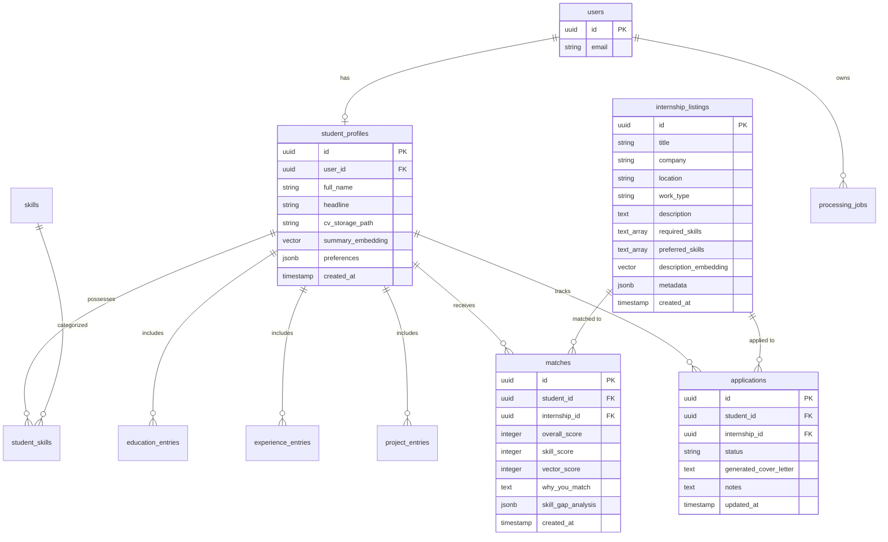

# InternMatch AI — Database Schema & Security Policy

**Version:** 1.0.0  
**Status:** Approved & Authoritative  
**Engine:** Supabase PostgreSQL 15+  
**Extensions Required:** `pgvector`, `uuid-ossp`

---

## 1. Relational Schema Overview

The database uses a modular PostgreSQL schema hosted on Supabase, leveraging `pgvector` for semantic similarity search over internship listings and student profiles.



---

## 2. Table Definitions & Types

### 2.1 Core Extensions setup
```sql
CREATE EXTENSION IF NOT EXISTS "uuid-ossp";
CREATE EXTENSION IF NOT EXISTS "vector";
```

### 2.2 Table: `student_profiles`
```sql
CREATE TABLE public.student_profiles (
    id UUID PRIMARY KEY DEFAULT uuid_generate_v4(),
    user_id UUID NOT NULL UNIQUE REFERENCES auth.users(id) ON DELETE CASCADE,
    full_name TEXT NOT NULL,
    headline TEXT,
    cv_storage_path TEXT,
    preferences JSONB DEFAULT '{"work_types": [], "desired_locations": []}'::jsonb,
    summary_embedding vector(1536),
    created_at TIMESTAMPTZ NOT NULL DEFAULT NOW(),
    updated_at TIMESTAMPTZ NOT NULL DEFAULT NOW()
);
```

### 2.3 Tables: Skills & Candidates Structured Data
```sql
CREATE TABLE public.skills (
    id UUID PRIMARY KEY DEFAULT uuid_generate_v4(),
    name TEXT NOT NULL UNIQUE,
    category TEXT
);

CREATE TABLE public.student_skills (
    student_id UUID NOT NULL REFERENCES public.student_profiles(id) ON DELETE CASCADE,
    skill_id UUID NOT NULL REFERENCES public.skills(id) ON DELETE RESTRICT,
    proficiency_level TEXT DEFAULT 'intermediate',
    PRIMARY KEY (student_id, skill_id)
);

CREATE TABLE public.education_entries (
    id UUID PRIMARY KEY DEFAULT uuid_generate_v4(),
    student_id UUID NOT NULL REFERENCES public.student_profiles(id) ON DELETE CASCADE,
    institution TEXT NOT NULL,
    degree TEXT NOT NULL,
    start_year INT,
    end_year INT
);

CREATE TABLE public.experience_entries (
    id UUID PRIMARY KEY DEFAULT uuid_generate_v4(),
    student_id UUID NOT NULL REFERENCES public.student_profiles(id) ON DELETE CASCADE,
    company TEXT NOT NULL,
    role TEXT NOT NULL,
    description TEXT,
    start_date DATE,
    end_date DATE
);

CREATE TABLE public.project_entries (
    id UUID PRIMARY KEY DEFAULT uuid_generate_v4(),
    student_id UUID NOT NULL REFERENCES public.student_profiles(id) ON DELETE CASCADE,
    title TEXT NOT NULL,
    tech_stack TEXT[],
    description TEXT
);
```

### 2.4 Table: `internship_listings` (Controlled 30–50 Dataset)
```sql
CREATE TABLE public.internship_listings (
    id UUID PRIMARY KEY DEFAULT uuid_generate_v4(),
    title TEXT NOT NULL,
    company TEXT NOT NULL,
    location TEXT NOT NULL,
    work_type TEXT NOT NULL CHECK (work_type IN ('remote', 'onsite', 'hybrid')),
    description TEXT NOT NULL,
    required_skills TEXT[] NOT NULL DEFAULT '{}',
    preferred_skills TEXT[] DEFAULT '{}',
    language TEXT DEFAULT 'English',
    education_requirements TEXT,
    experience_requirements TEXT,
    metadata JSONB DEFAULT '{}'::jsonb,
    description_embedding vector(1536),
    created_at TIMESTAMPTZ NOT NULL DEFAULT NOW()
);
```

### 2.5 Table: `matches`
```sql
CREATE TABLE public.matches (
    id UUID PRIMARY KEY DEFAULT uuid_generate_v4(),
    student_id UUID NOT NULL REFERENCES public.student_profiles(id) ON DELETE CASCADE,
    internship_id UUID NOT NULL REFERENCES public.internship_listings(id) ON DELETE CASCADE,
    overall_score INT NOT NULL CHECK (overall_score BETWEEN 0 AND 100),
    skill_score INT NOT NULL CHECK (skill_score BETWEEN 0 AND 100),
    vector_score INT NOT NULL CHECK (vector_score BETWEEN 0 AND 100),
    attribute_score INT NOT NULL CHECK (attribute_score BETWEEN 0 AND 100),
    why_you_match TEXT,
    skill_gap_analysis JSONB DEFAULT '{}'::jsonb,
    created_at TIMESTAMPTZ NOT NULL DEFAULT NOW(),
    UNIQUE(student_id, internship_id)
);
```

*Canonical Skill Gap Data Architecture Note:* `skill_gap_analysis` JSONB is the **single canonical persisted source of truth** for match skill gaps and recommendations. It avoids column duplication by storing matching skills, missing skills, and recommendations in a single structured JSON payload:
```json
{
  "matching_skills": ["Python", "FastAPI", "PostgreSQL"],
  "missing_skills": ["Docker", "Redis"],
  "summary": "You are missing 2 preferred containerization & caching skills.",
  "recommendations": [
    "Complete a 2-hour tutorial on Docker basics and containerize a simple FastAPI service.",
    "Learn basic Redis key-value caching patterns."
  ]
}
```
API endpoints (`GET /matches/{id}/explanation`) derive top-level `matching_skills` and `missing_skills` directly from this canonical JSONB column without redundant table columns.

### 2.6 Table: `applications` (Tracker)
```sql
CREATE TABLE public.applications (
    id UUID PRIMARY KEY DEFAULT uuid_generate_v4(),
    student_id UUID NOT NULL REFERENCES public.student_profiles(id) ON DELETE CASCADE,
    internship_id UUID REFERENCES public.internship_listings(id) ON DELETE SET NULL,
    status TEXT NOT NULL DEFAULT 'saved' CHECK (status IN ('saved', 'applied', 'interviewing', 'rejected', 'accepted')),
    generated_cover_letter TEXT,
    notes TEXT,
    created_at TIMESTAMPTZ NOT NULL DEFAULT NOW(),
    updated_at TIMESTAMPTZ NOT NULL DEFAULT NOW(),
    UNIQUE(student_id, internship_id)
);
```

*Historical Record Preservation Note:* `applications.internship_id` uses `ON DELETE SET NULL`. If an internship listing is removed or archived, the candidate's historical application record, cover letter text, notes, and application status are preserved for student tracking history rather than being erased.

### 2.7 Foreign Key Delete Policy Summary Matrix

| Foreign Key Relationship | Delete Action | Architectural Rationale |
| :--- | :--- | :--- |
| `student_profiles.user_id` $\rightarrow$ `auth.users(id)` | `ON DELETE CASCADE` | Hard deletion of auth account purges profile. |
| `student_skills.student_id` $\rightarrow$ `student_profiles(id)` | `ON DELETE CASCADE` | Skills belong strictly to student profile. |
| `student_skills.skill_id` $\rightarrow$ `skills(id)` | `ON DELETE RESTRICT` | Prevents accidental deletion of master taxonomy skills. |
| `education_entries.student_id` $\rightarrow$ `student_profiles(id)` | `ON DELETE CASCADE` | Education entries belong strictly to profile. |
| `experience_entries.student_id` $\rightarrow$ `student_profiles(id)` | `ON DELETE CASCADE` | Work entries belong strictly to profile. |
| `project_entries.student_id` $\rightarrow$ `student_profiles(id)` | `ON DELETE CASCADE` | Projects belong strictly to profile. |
| `processing_jobs.user_id` $\rightarrow$ `auth.users(id)` | `ON DELETE CASCADE` | Jobs belong to user session. |
| `matches.student_id` $\rightarrow$ `student_profiles(id)` | `ON DELETE CASCADE` | Match scores belong to candidate profile. |
| `matches.internship_id` $\rightarrow$ `internship_listings(id)` | `ON DELETE CASCADE` | Matches are ephemeral calculations tied to listing. |
| `applications.student_id` $\rightarrow$ `student_profiles(id)` | `ON DELETE CASCADE` | Application tracker records belong to candidate. |
| `applications.internship_id` $\rightarrow$ `internship_listings(id)` | `ON DELETE SET NULL` | Preserves candidate application history & cover letters. |


### 2.7 Table: `processing_jobs`
```sql
CREATE TABLE public.processing_jobs (
    id UUID PRIMARY KEY DEFAULT uuid_generate_v4(),
    user_id UUID NOT NULL REFERENCES auth.users(id) ON DELETE CASCADE,
    job_type TEXT NOT NULL CHECK (job_type IN ('cv_extraction', 'match_calculation', 'application_generation')),
    status TEXT NOT NULL DEFAULT 'queued' CHECK (status IN ('queued', 'processing', 'completed', 'failed')),
    progress_percent INT NOT NULL DEFAULT 0 CHECK (progress_percent BETWEEN 0 AND 100),
    result JSONB,
    error TEXT,
    created_at TIMESTAMPTZ NOT NULL DEFAULT NOW(),
    updated_at TIMESTAMPTZ NOT NULL DEFAULT NOW()
);
```

---


## 3. Database Indexes & Vector Optimization

```sql
-- Vector Similarity Index (HNSW using cosine distance)
CREATE INDEX idx_internships_embedding_hnsw 
ON public.internship_listings 
USING hnsw (description_embedding vector_cosine_ops);

-- B-Tree Indexes on Foreign Keys & Query Paths
CREATE INDEX idx_student_profiles_user_id ON public.student_profiles(user_id);
CREATE INDEX idx_matches_student_score ON public.matches(student_id, overall_score DESC);
CREATE INDEX idx_applications_student_status ON public.applications(student_id, status);
CREATE INDEX idx_processing_jobs_user_status ON public.processing_jobs(user_id, status);
```

---

## 4. Row Level Security (RLS) Policies

RLS is strictly enforced on all tables containing student data to guarantee complete isolation.

```sql
-- Enable RLS on user-owned tables
ALTER TABLE public.student_profiles ENABLE ROW LEVEL SECURITY;
ALTER TABLE public.education_entries ENABLE ROW LEVEL SECURITY;
ALTER TABLE public.experience_entries ENABLE ROW LEVEL SECURITY;
ALTER TABLE public.project_entries ENABLE ROW LEVEL SECURITY;
ALTER TABLE public.matches ENABLE ROW LEVEL SECURITY;
ALTER TABLE public.applications ENABLE ROW LEVEL SECURITY;
ALTER TABLE public.processing_jobs ENABLE ROW LEVEL SECURITY;
ALTER TABLE public.internship_listings ENABLE ROW LEVEL SECURITY;

-- Student Profiles Policy: Owner full access
CREATE POLICY student_profiles_owner_policy ON public.student_profiles
    FOR ALL USING (auth.uid() = user_id);

-- Matches Policy: Student can view own matches
CREATE POLICY matches_owner_policy ON public.matches
    FOR ALL USING (
        student_id IN (SELECT id FROM public.student_profiles WHERE user_id = auth.uid())
    );

-- Applications Policy: Student can manage own application records
CREATE POLICY applications_owner_policy ON public.applications
    FOR ALL USING (
        student_id IN (SELECT id FROM public.student_profiles WHERE user_id = auth.uid())
    );

-- Processing Jobs Policy: User can view own jobs
CREATE POLICY processing_jobs_owner_policy ON public.processing_jobs
    FOR ALL USING (auth.uid() = user_id);

-- Internship Listings Policy: Read-only for authenticated users
CREATE POLICY internship_listings_read_policy ON public.internship_listings
    FOR SELECT TO authenticated USING (true);
```
