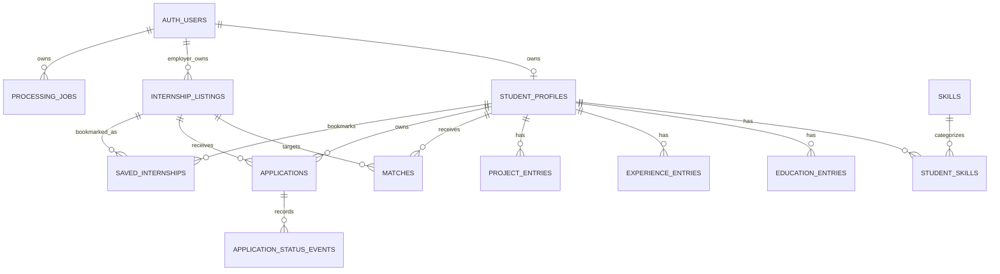

# InternMatch AI - Database Schema & Security Policy

**Version:** 1.0.0
**Status:** Approved & Authoritative
**Migration Compatibility:** Supabase PostgreSQL 15+
**Local Docker Reference Runtime:** PostgreSQL 17 via `pgvector/pgvector:0.8.6-pg17-bookworm`
**Required Extensions:** `pgvector`, `uuid-ossp`

---

## 1. Source of Truth

The canonical database definition is the ordered migration chain in `database/migrations/`.

This document describes the effective schema after migrations `001` through `010`. It intentionally avoids duplicating every executable `CREATE TABLE` statement because the migration files remain the authoritative source for provisioning, constraints, indexes, privileges, and Row Level Security policies.

Canonical migration order:

1. `database/migrations/001_initial_schema.sql`
2. `database/migrations/002_rls_policies.sql`
3. `database/migrations/003_add_processing_job_progress.sql`
4. `database/migrations/004_add_application_applied_date.sql`
5. `database/migrations/005_add_avatar_storage_path.sql`
6. `database/migrations/006_add_saved_internships.sql`
7. `database/migrations/007_add_application_status_events.sql`
8. `database/migrations/008_add_internship_employer_ownership.sql`
9. `database/migrations/009_add_internship_lifecycle_status.sql`
10. `database/migrations/010_add_application_interview_schedule.sql`

After schema migrations, `database/supabase_storage_setup.sql` provides the repository-managed Supabase Storage setup described in Section 8.

---

## 2. Effective Relational Model



`AUTH_USERS` represents Supabase `auth.users`; it is managed by Supabase Auth and is not created by the application migrations.

---

## 3. Effective Table Contract

### 3.1 `student_profiles`

Candidate profile and embedding record.

Key fields:

- `id` - UUID primary key
- `user_id` - unique FK to `auth.users(id)`, `ON DELETE CASCADE`
- `full_name`
- `headline`
- `cv_storage_path`
- `avatar_storage_path` - added by migration `005`
- `preferences` - JSONB
- `summary_embedding` - `vector(1536)`
- `created_at`
- `updated_at`

### 3.2 `skills` and `student_skills`

`skills` stores the shared skill taxonomy.

`student_skills` maps candidate profiles to skills with a composite primary key and candidate ownership through `student_id`.

`student_skills.skill_id` uses `ON DELETE RESTRICT` so taxonomy entries cannot be removed while still referenced.

### 3.3 Structured Candidate Data

The following tables are candidate-owned and reference `student_profiles(id)` with `ON DELETE CASCADE`:

- `education_entries`
- `experience_entries`
- `project_entries`

### 3.4 `internship_listings`

Canonical internship opportunity catalog.

Key fields include:

- `id`
- `title`
- `company`
- `location`
- `work_type` - `remote`, `onsite`, or `hybrid`
- `description`
- `required_skills`
- `preferred_skills`
- `language`
- `education_requirements`
- `experience_requirements`
- `metadata`
- `description_embedding` - `vector(1536)`
- `created_at`
- `employer_user_id` - added by migration `008`, FK to `auth.users(id)` with `ON DELETE SET NULL`
- `is_active` - added by migration `009`, defaults to `TRUE`

`employer_user_id` establishes backend-enforced employer ownership. `is_active` provides opportunity lifecycle state without deleting historical records.

### 3.5 `matches`

Persisted candidate-to-internship match results.

Key fields include:

- `student_id`
- `internship_id`
- `overall_score`
- `skill_score`
- `vector_score`
- `attribute_score`
- `why_you_match`
- `skill_gap_analysis`
- `created_at`

Scores are constrained to `0..100`.

The pair `(student_id, internship_id)` is unique.

`skill_gap_analysis` JSONB is the canonical persisted source for matching skills, missing skills, summary information, and recommendations. API response fields such as `matching_skills` and `missing_skills` are derived from this structured payload rather than duplicated as database columns.

### 3.6 `applications`

Candidate application and tracker record.

Current fields include:

- `id`
- `student_id`
- nullable `internship_id`
- `status`
- `generated_cover_letter`
- `applied_date` - added by migration `004`
- `notes`
- `interview_scheduled_at` - added by migration `010`
- `interview_mode` - `online`, `onsite`, or `NULL`
- `interview_location`
- `interview_message`
- `created_at`
- `updated_at`

Allowed status values are:

```text
saved
applied
interviewing
rejected
accepted
```

`applications.internship_id` uses `ON DELETE SET NULL`, preserving candidate application history if a linked listing is removed.

The application lifecycle is enforced by backend rules, not by treating every status value as candidate-editable:

```text
Candidate:
saved -> applied

Employer:
applied -> interviewing | accepted | rejected
interviewing -> accepted | rejected

Terminal:
accepted
rejected
```

Candidates cannot manually set `interviewing`, `accepted`, or `rejected`, and a submitted application cannot be reverted to `saved`.

Scheduling an interview for an `applied` application promotes it to `interviewing`.

### 3.7 `application_status_events`

Added by migration `007`.

This table stores the authoritative chronological application-status timeline.

Key fields:

- `id`
- `application_id` - FK to `applications(id)`, `ON DELETE CASCADE`
- `status`
- `occurred_at`

Allowed event statuses match the canonical application status set.

The chronological index is ordered by:

```text
application_id, occurred_at ASC, id ASC
```

### 3.8 `saved_internships`

Added by migration `006`.

Candidate bookmark table with:

- `id`
- `student_id`
- `internship_id`
- `created_at`

The pair `(student_id, internship_id)` is unique.

Deleting a candidate profile or internship cascades to its bookmark records.

### 3.9 `processing_jobs`

Authenticated asynchronous work tracking.

Key fields:

- `id`
- `user_id` - FK to `auth.users(id)`, `ON DELETE CASCADE`
- `job_type`
- `status`
- `progress_percent` - added by migration `003`, constrained to `0..100`
- `result`
- `error`
- `created_at`
- `updated_at`

Canonical job types remain:

```text
cv_extraction
match_calculation
application_generation
```

Canonical job statuses are:

```text
queued
processing
completed
failed
```

AI interview preparation is not represented as a new `processing_jobs.job_type` in the current schema.

---

## 4. Vector Search & Matching Persistence

InternMatch AI uses `pgvector` with `1536`-dimension embeddings for:

- `student_profiles.summary_embedding`
- `internship_listings.description_embedding`

The initial schema creates an HNSW cosine-distance index for internship description embeddings.

Hybrid ranking combines vector similarity with skill and structured attribute scoring before persisting final match results.

---

## 5. Referential Integrity & Delete Semantics

| Relationship | Delete Behavior | Purpose |
| :--- | :--- | :--- |
| `student_profiles.user_id -> auth.users.id` | `CASCADE` | Remove candidate-owned profile data with account deletion |
| candidate structured tables -> `student_profiles.id` | `CASCADE` | Child records belong to candidate profile |
| `student_skills.skill_id -> skills.id` | `RESTRICT` | Protect referenced taxonomy entries |
| `matches.student_id -> student_profiles.id` | `CASCADE` | Match results belong to candidate |
| `matches.internship_id -> internship_listings.id` | `CASCADE` | Match is derived from listing |
| `applications.student_id -> student_profiles.id` | `CASCADE` | Applications belong to candidate |
| `applications.internship_id -> internship_listings.id` | `SET NULL` | Preserve application history |
| `saved_internships.student_id -> student_profiles.id` | `CASCADE` | Bookmark belongs to candidate |
| `saved_internships.internship_id -> internship_listings.id` | `CASCADE` | Bookmark requires listing |
| `application_status_events.application_id -> applications.id` | `CASCADE` | Timeline belongs to application |
| `internship_listings.employer_user_id -> auth.users.id` | `SET NULL` | Preserve opportunity data if employer identity is removed |
| `processing_jobs.user_id -> auth.users.id` | `CASCADE` | Job state belongs to authenticated user |

---

## 6. Indexing Strategy

The migration chain defines indexes for the primary runtime query paths, including:

- HNSW cosine index on internship embeddings
- student-profile lookup by `user_id`
- candidate matches ordered by score
- application lookup by candidate and status
- processing-job lookup by user and status
- saved internships ordered by candidate and creation time
- saved internship lookup by internship
- application status-event chronological lookup
- employer-owned internship lookup
- active internship filtering

Indexes are defined by migrations and should not be recreated independently from this document.

---

## 7. Row Level Security & PostgreSQL Privileges

RLS is enabled by migration `002` on the ten original application tables:

- `student_profiles`
- `skills`
- `student_skills`
- `education_entries`
- `experience_entries`
- `project_entries`
- `internship_listings`
- `matches`
- `applications`
- `processing_jobs`

Migration `006` independently enables RLS for `saved_internships`.

Migration `007` independently enables RLS for `application_status_events`.

Therefore, after migrations `001` through `010`, all twelve application-owned public tables have RLS enabled.

### 7.1 Candidate-Owned Data

Authenticated candidate access is scoped through `auth.uid()` either directly through `user_id` or indirectly through the owning `student_profiles` record.

Candidate-owned mutable tables include profile data, structured education/experience/project data, student skills, application records, and saved internships according to their migration-defined privileges.

### 7.2 Read-Only Data

`skills` and `internship_listings` provide catalog-style `SELECT` access to `anon` and `authenticated` roles.

`matches` and `processing_jobs` provide authenticated read access scoped by ownership policies.

`application_status_events` provides candidate-owned timeline access according to migration `007`.

### 7.3 Trusted Backend Writes

Privileged backend operations use trusted server-side credentials and remain subject to application authorization rules.

This is particularly important for employer-owned opportunity management and employer-controlled application transitions: direct public PostgreSQL privileges are not the authority for these workflows.

Service-role credentials MUST remain server-side and MUST never be shipped to mobile or web clients.

---

## 8. Supabase Storage Boundary

`database/supabase_storage_setup.sql` currently provisions the private `avatars` bucket.

Current repository-managed avatar storage contract:

- bucket id/name: `avatars`
- public access: `false`
- maximum file size: `5 MB`
- allowed MIME types:
  - `image/jpeg`
  - `image/png`
  - `image/webp`

Avatar upload, deletion, and signed-URL generation are mediated by the FastAPI backend using verified JWT identity and server-side credentials.

The current `database/supabase_storage_setup.sql` file does **not** provision the CV bucket. CV storage uses the separately configured `CV_STORAGE_BUCKET` runtime contract and must not be assumed to be created by this storage SQL file.

---

## 9. Migration & Provisioning Rules

For a fresh database environment:

1. Apply migrations `001` through `010` in numeric order.
2. Apply `database/supabase_storage_setup.sql` for the repository-managed avatar storage setup.
3. Configure any additional runtime storage required by the environment, including the configured CV storage bucket.
4. Keep database, Supabase service-role, and storage-management credentials server-side.
5. Do not modify an already-applied migration to represent a later schema change; add a new ordered migration instead.

The migration chain is authoritative. SQL examples in documentation are explanatory only.

---

## 10. Compatibility Boundary

The migration files declare compatibility with **Supabase PostgreSQL 15+**.

The canonical local Docker reference currently uses:

```text
pgvector/pgvector:0.8.6-pg17-bookworm
```

which provides the project's PostgreSQL 17 local evaluation baseline.

These statements describe two different boundaries:

- migration compatibility floor: Supabase PostgreSQL 15+
- current local container baseline: PostgreSQL 17

Documentation MUST NOT infer the exact PostgreSQL version of an external managed Supabase project unless that deployed environment has been independently verified.

---

## 11. Security Invariants

The database layer follows these non-negotiable rules:

- Supabase `auth.users` is the identity source; the application does not create a duplicate public users table.
- Candidate-owned data is isolated by RLS and backend ownership checks.
- Employer mutations require authenticated employer authorization and opportunity ownership.
- Service-role credentials stay exclusively on trusted backend infrastructure.
- Application terminal states are employer-managed.
- Historical application timelines are persisted in `application_status_events`.
- Embeddings use the configured `1536`-dimension contract.
- Repository migrations, not prose documentation, are the executable schema source of truth.

---

**End of Database Contract**
