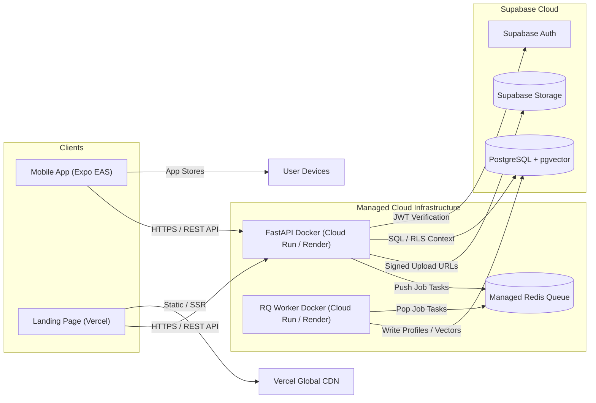

# InternMatch AI — Deployment Architecture & Production Guide

**Version:** 1.0.0  
**Status:** Approved & Authoritative  
**Target Environments:** Vercel (Landing), Expo EAS (Mobile), Managed Cloud Containers (Backend/Worker), Supabase Cloud (Data)

---

## 1. Deployment Topology & Platform Matrix

| Application Component | Target Platform | Deployment Strategy | Responsible Engineer |
| :--- | :--- | :--- | :--- |
| **Landing Page** | Vercel | Native Next.js Git Deployment | Selen |
| **Mobile Application** | Expo Application Services (EAS) | Standalone iOS / Android App Builds | Selen |
| **Backend Gateway** | Managed Docker Host (Cloud Run / Render) | Containerized FastAPI Docker Build | Mohammad |
| **Background Worker** | Managed Docker Host / Worker Service | Containerized RQ Worker Docker Build | Mohammad |
| **Database & Vector DB** | Supabase Cloud | Managed PostgreSQL 15+ (`pgvector`) | Mohammad |
| **Authentication & Auth** | Supabase Auth | Managed Supabase Identity Provider | Mohammad |
| **Object Storage** | Supabase Storage | Private Bucket (`student-cvs`) | Mohammad |
| **Redis Queue** | Managed Redis (Upstash / Redis Cloud) | Managed Redis Instance | Mohammad |



---

## 2. Containerization Strategy (Docker)

### 2.1 Backend Dockerfile (`backend/Dockerfile`)
- Base Image: `python:3.13-slim`
- User Execution: Non-root user for container hardening.
- Production Server: `uvicorn` with multiple worker processes or `gunicorn` with `uvicorn.workers.UvicornWorker`.
- Exposed Port: `8000`

### 2.2 Worker Dockerfile (`worker/Dockerfile`)
- Base Image: `python:3.13-slim`
- Execution: `rq worker --url $REDIS_URL default`
- Isolated runtime to prevent worker crashes from affecting primary API server.

---

## 3. Database Migration & Provisioning Strategy

1. **Schema Management:** Supabase CLI manages migrations stored in `database/migrations/`.
2. **CI/CD Deployment:**
   ```bash
   # Link project
   supabase link --project-ref <SUPABASE_PROJECT_REF>
   
   # Apply migrations to production database
   supabase db push
   ```
3. **Rollback Policy:** Every migration MUST include a corresponding down migration or reversible SQL script.

---

## 4. Production Health Checks & Monitoring

1. **Dual Health Check Endpoints:**
   - **Infrastructure Liveness Probe:** `GET /health` (Used by Docker Compose / Cloud container orchestrators for HTTP process liveness).
   - **Versioned API Health Endpoint:** `GET /api/v1/health` (Returns DB connectivity status, Redis ping, and worker queue readiness).
   ```json
   {
     "status": "healthy",
     "version": "1.0.0",
     "database": "connected",
     "redis": "connected",
     "timestamp": "2026-08-10T17:00:00Z"
   }
   ```
2. **Container Restart Policy:** Containers configured with `restart: unless-stopped` in Compose or cloud orchestrator auto-restart rules.


---

## 5. RevenueCat Production Setup & Store Integration

1. **Store Console Linking:**
   - Connect RevenueCat project to Apple App Store Connect (In-App Purchase Shared Secret / App Store Connect API Key).
   - Connect RevenueCat project to Google Play Console (Service Account JSON key with Financial access).
2. **Production Entitlement & Products:**
   - Products: `internmatch_pro_monthly`, `internmatch_pro_annual`.
   - Entitlement ID: `internmatch_pro`.
3. **Environment Production Keys:**
   - Client EAS secret injection: `EXPO_PUBLIC_REVENUECAT_APPLE_KEY`, `EXPO_PUBLIC_REVENUECAT_GOOGLE_KEY`.
   - Backend optional secret key: `REVENUECAT_SECRET_KEY` injected into Cloud Run / Render environment variables.
4. **Next Gen Student Track Sandbox Mode:**
   - As per Shipaton rules for student entries, live App Store publishing is exempt; however, the RevenueCat production configuration must be verified and ready for live switch over. TestFlight and sandbox accounts operate with active entitlement verification.


