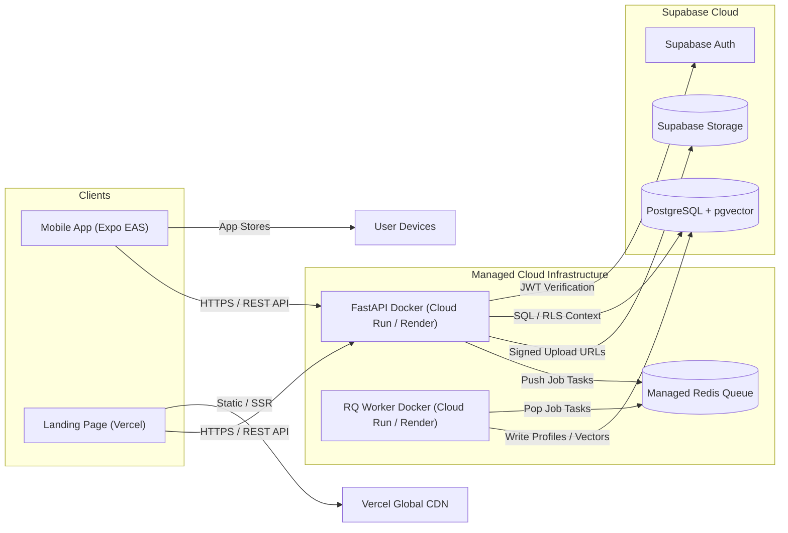

# InternMatch AI — Deployment Architecture & Production Guide

**Version:** 1.0.0  
**Status:** Approved & Authoritative  
**Target Environments:** Vercel (Landing), Expo EAS (Mobile), Managed Cloud Containers (Backend/Worker), Supabase Cloud (Data)

---

## 1. Deployment Topology & Platform Matrix

| Application Component | Target Platform | Deployment Strategy | Responsible Engineer |
| :--- | :--- | :--- | :--- |
| **Landing Page** | Vercel | Native Next.js Git Deployment | Selen |
| **Mobile Application** | Expo Application Services (EAS) | Standalone iOS / Android App Builds | Selen |
| **Backend Gateway** | Managed Docker Host (Cloud Run / Render) | Containerized FastAPI Docker Build | Mohammad |
| **Background Worker** | Managed Docker Host / Worker Service | Containerized RQ Worker Docker Build | Mohammad |
| **Database & Vector DB** | Supabase Cloud | Managed PostgreSQL 15+ (`pgvector`) | Mohammad |
| **Authentication & Auth** | Supabase Auth | Managed Supabase Identity Provider | Mohammad |
| **Object Storage** | Supabase Storage | Private Bucket (`student-cvs`) | Mohammad |
| **Redis Queue** | Managed Redis (Upstash / Redis Cloud) | Managed Redis Instance | Mohammad |



---

## 2. Containerization Strategy (Docker)

### 2.1 Backend Dockerfile (`backend/Dockerfile`)
- Base Image: `python:3.13-slim`
- User Execution: Hardened non-root `appuser`.
- Container Runtime Command: `uvicorn app.main:app --host 0.0.0.0 --port 8000`
- Scaling: Horizontal replica scaling is delegated to the managed container platform (e.g. Cloud Run / Render) when required.
- Exposed Port: `8000`

### 2.2 Worker Dockerfile (`worker/Dockerfile`)
- Base Image: `python:3.13-slim`
- User Execution: Hardened non-root `appuser`.
- Container Runtime Command: `python worker.py`
- Worker Architecture (`worker.py`):
  - Validates production configuration (`validate_production_config`) before executing network operations.
  - Verifies Redis connectivity with `ping()`.
  - Creates and listens on configured RQ queues defined by the `QUEUES` environment variable (defaulting to `default`).
  - Processes jobs using `Worker.work()`.
  - Operates as an isolated worker runtime to prevent crashes from impacting the primary API server.

---

## 3. Database Migration & Provisioning Strategy

1. **Schema Management:** Supabase CLI manages ordered SQL migrations stored in `database/migrations/`.
2. **CI/CD Deployment:**
   ```bash
   # Link project
   supabase link --project-ref <SUPABASE_PROJECT_REF>
   
   # Apply ordered migrations to production database
   supabase db push
   ```
3. **Rollback Policy:** Every migration MUST include a corresponding down migration or reversible SQL script.

---

## 4. Production Health Checks & Monitoring

1. **Dual Health Check Endpoints:**
   - **Infrastructure Liveness Probe (`GET /health`):**
     - Used by Docker container orchestrators and load balancers for HTTP process liveness.
     - Dependency-independent: performs zero database, Redis, or queue operations.
     - Returns HTTP 200 when the FastAPI process is alive and responsive.
   - **Versioned Operational Readiness Probe (`GET /api/v1/health`):**
     - Used for traffic routing and operational monitoring.
     - Probes PostgreSQL database connectivity (`SELECT 1`).
     - Probes Redis connectivity (`PING`) with bounded timeouts.
     - Probes RQ worker readiness (`Worker.count(queue=default) >= 1`).
     - Returns HTTP 200 only when all three components are ready.
     - Returns HTTP 503 Service Unavailable if any component is unavailable, without leaking credentials or internal exception details.
   ```json
   {
     "status": "healthy",
     "version": "1.0.0",
     "environment": "production",
     "database": "connected",
     "redis": "connected",
     "worker": "ready",
     "timestamp": "2026-08-14T19:00:00Z"
   }
   ```
2. **Container Restart Policy:** Containers configured with `restart: unless-stopped` in Compose or cloud orchestrator auto-restart rules.

---

## 5. Minimal Production Deployment Runbook

Follow this concise operational deployment sequence when deploying to production:

1. **Provision Environment Variables:** Securely configure all required production environment variables (`SUPABASE_URL`, `SUPABASE_JWT_SECRET`, `DATABASE_URL`, `REDIS_URL`, `OPENAI_API_KEY`, etc.).
2. **Validate Configuration:** Configuration is automatically validated against production security rules on application and worker startup.
3. **Apply Database Migrations:** Apply ordered SQL migrations to the production database via Supabase CLI (`supabase db push`).
4. **Seed Demo Internship Data (If Applicable):** When synthetic demo listings are required, execute the seeder from a trusted release environment:
   ```bash
   python scripts/seed_internships.py
   ```
   *Note: This command requires direct access to `DATABASE_URL` and `OPENAI_API_KEY` and is run as a release step, not as a container startup hook.*
5. **Deploy & Start Managed Redis:** Ensure managed Redis instance is active and reachable.
6. **Deploy & Start Background Worker:** Deploy the hardened worker container (`python worker.py`).
7. **Deploy & Start Backend Gateway:** Deploy the backend container (`uvicorn app.main:app`).
8. **Verify Service Health:**
   - Check process liveness: `GET /health` -> `HTTP 200`
   - Check operational readiness: `GET /api/v1/health` -> `HTTP 200` (`database: connected`, `redis: connected`, `worker: ready`)
9. **Handle Readiness Failures:** If `/api/v1/health` returns `HTTP 503`, inspect the structured component status (`database`, `redis`, `worker`) and platform logs. Do not treat `/health` 200 as proof that dependent services are ready.

---

## 6. RevenueCat Production Setup & Store Integration

1. **Store Console Linking:**
   - Connect RevenueCat project to Apple App Store Connect (In-App Purchase Shared Secret / App Store Connect API Key).
   - Connect RevenueCat project to Google Play Console (Service Account JSON key with Financial access).
2. **Production Entitlement & Products:**
   - Products: `internmatch_pro_monthly`, `internmatch_pro_annual`.
   - Entitlement ID: `internmatch_pro`.
3. **Environment Production Keys:**
   - Client EAS secret injection: `EXPO_PUBLIC_REVENUECAT_APPLE_KEY`, `EXPO_PUBLIC_REVENUECAT_GOOGLE_KEY`.
   - Backend optional secret key: `REVENUECAT_SECRET_KEY` injected into Cloud Run / Render environment variables.
4. **Next Gen Student Track Sandbox Mode:**
   - As per Shipaton rules for student entries, live App Store publishing is exempt; however, the RevenueCat production configuration must be verified and ready for live switch over. TestFlight and sandbox accounts operate with active entitlement verification.
